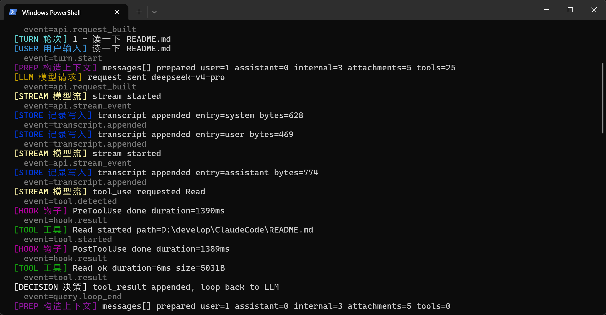

# Claude Code Harness Lab

这是一个面向 Claude Code CLI 逆向学习、恢复、裁剪和可观测性实验的工程仓库。

本仓库来源于 [claude-code-best/claude-code](https://github.com/claude-code-best/claude-code) 的代码基础，但当前目标已经不同：这里不是上游项目主页，也不是 Anthropic 官方 Claude Code。这里更像一个本地 Harness Lab，用来研究 Claude Code 的核心循环、工具调用、上下文组装、provider 适配和 trace 观测能力。

## 当前重点

- 恢复可运行的 CLI / REPL / pipe 模式。
- 保持 Bun + TypeScript strict 的工程约束。
- 裁剪和隔离与当前研究目标不匹配的上游内容。
- 保留多 provider 兼容层，便于研究不同模型后端。
- 建立 Harness Trace，让 CLI 运行过程可以被学习、回放和验证。
- 默认 CLI 优先，JSONL 作为第一版 source of truth，不优先做 Web UI。

## Harness Trace

Harness Trace 是这个仓库目前最重要的研究能力之一。它把一次 Claude Code 对话拆成可观察的 Agent Loop Stream：

```text
USER -> PREP -> LLM -> STREAM -> TOOL/HOOK -> STORE -> DECISION -> loop back
```

learn 模式下的实时效果：



这些阶段的含义：

| 阶段 | 含义 |
| --- | --- |
| `TURN 轮次` | 一次用户请求对应的主轮次 |
| `USER 用户输入` | 当前轮次的用户原始意图 |
| `PREP 构造上下文` | messages、内部上下文、工具列表等准备过程 |
| `LLM 模型请求` | 发送给模型的一次请求 |
| `STREAM 模型流` | 模型流式返回、tool_use 请求等 |
| `HOOK 钩子` | PreToolUse / PostToolUse 等扩展点 |
| `TOOL 工具` | Read、Edit、Bash 等工具执行 |
| `STORE 记录写入` | transcript / trace session 等持久化动作 |
| `DECISION 决策` | tool_result 后继续循环，或完成返回 |
| `SIDE 旁路任务` | 标题生成、记忆提取、摘要等旁路调用 |

Trace 的核心边界：

- 默认关闭。
- `learn` / `full` 必须手动开启，并持续到显式 `off`。
- trace 是 observer，不把 trace 数据注入 model messages、system prompt、user context 或 tool input。
- JSONL 是第一版 source of truth。
- CLI viewer 优先，Web UI 暂不作为第一阶段目标。

## 快速开始

安装依赖：

```powershell
bun install
```

启动本地 Claude Code CLI：

```powershell
bun run dev
```

Pipe 模式：

```powershell
"say hello" | bun run src/entrypoints/cli.tsx -p
```

构建：

```powershell
bun run build
```

## Trace 使用方式

查看当前 trace 状态：

```powershell
bun run dev trace status
```

开启 learn 模式：

```powershell
bun run dev trace learn
```

开启 full 模式：

```powershell
bun run dev trace full
```

关闭 trace：

```powershell
bun run dev trace off
```

启动 REPL 后，也可以在交互界面里输入：

```text
/trace learn
/trace full
/trace off
```

实时查看当前 session：

```powershell
bun run dev trace tail
```

查看更深入的结构化流：

```powershell
bun run dev trace tail --deep
```

查看原始 JSONL：

```powershell
bun run dev trace tail --raw
```

列出历史 session：

```powershell
bun run dev trace list
```

回放历史 session：

```powershell
bun run dev trace replay <session-id>
```

回放 deep 视图：

```powershell
bun run dev trace replay <session-id> --deep
```

回放原始 JSONL：

```powershell
bun run dev trace replay <session-id> --raw
```

## 验证命令

日常修改后至少运行：

```powershell
bun run typecheck
```

Trace 相关修改运行：

```powershell
bun test src/trace
```

Slash command 相关修改运行：

```powershell
bun test src/commands/trace
```

更大范围验证：

```powershell
bun test
```

## 目录导览

| 路径 | 说明 |
| --- | --- |
| `src/entrypoints/cli.tsx` | CLI 真实入口 |
| `src/main.tsx` | Commander CLI 定义和主命令分发 |
| `src/query.ts` | 核心 query loop，处理模型请求、流式响应和工具调用 |
| `src/QueryEngine.ts` | REPL 使用的高层 query 编排 |
| `src/services/api/` | Anthropic 与第三方 provider 兼容层 |
| `src/tools.ts` | 工具注册入口 |
| `packages/builtin-tools/` | 内置工具实现 |
| `src/trace/` | Harness Trace 核心实现和 CLI viewer |
| `src/commands/trace/` | `/trace` slash command |
| `docs/adr/` | 架构决策记录 |
| `docs/superpowers/plans/` | 实施计划和 review 记录 |

## 工程约束

- Runtime 使用 Bun，不按 Node-only 项目处理。
- TypeScript strict 必须保持零错误。
- 生产代码避免 `as any`。
- 新功能优先通过 feature flag 或显式命令启用。
- 不重写 `feature()` 机制。
- 不提交临时 trace 数据、构建产物、个人工作目录或未确认生成文件。
- Commit message 使用 Conventional Commits，例如：

```text
feat: add harness trace viewer
fix: harden trace tail orientation
docs: rewrite project readme
```

## 与上游项目的关系

本仓库保留了上游代码基础中的大量工程模块，但 README、测试策略和后续改动都以当前 Harness Lab 目标为准。若上游遗留说明和当前目标冲突，以本 README、`CLAUDE.md` / `AGENTS.md` 和仓库内最新计划文档为准。

## 免责声明

本项目仅用于学习、研究和本地工程验证。Claude Code 及相关商标、产品权利归 Anthropic 所有。本仓库不是 Anthropic 官方项目。
